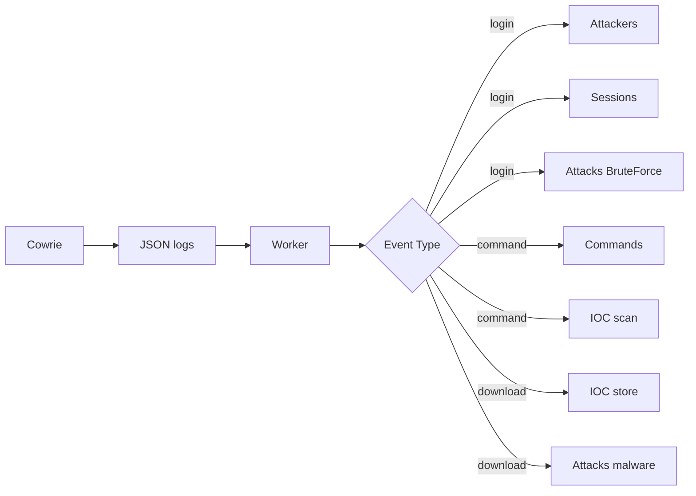

# Architecture Technique - Honeypot SOC

> Code-first documentation - alignée avec docker-compose.yml implémenté

## Infrastructure Docker

### Services déployés (docker-compose.yml)

| Service | Image | Port | Purpose |
|---------|-------|------|---------|
| api | Custom (python:3.11) | 8000 | FastAPI honeypot framework |
| postgres | postgres:15-alpine | 5432 | Persisté PostgreSQL |
| redis | redis:7-alpine | 6379 | Cache + threat intel queue |
| rabbitmq | rabbitmq:3-management-alpine | 5672 | Messaging inter-services |
| cowrie | Custom build | 22/23 | SSH/Telnet honeypot |
| worker | Custom | - | Cowrie log ingestion |
| prometheus | prom/prometheus | 9090 | Métriques temps réel |
| grafana | grafana/grafana:11.0.0 | 3000 | Dashboard monitoring |

### Volumes persistés
- `postgres_data` : Base de données
- `cowrie_logs` : Logs JSON Cowrie
- `cowrie_data` : SSH keys
- `grafana_data` : Dashboard persisté

### Réseaux
- Tous services sur réseau Docker par défaut
- Ports exposés uniquement localhost (reverse proxy Apache)

## Architecture applicative

```
┌─────────────────────────────────────────────────────────────┐
│                        Dashboard                          │
│        (HTML + WebSocket + HTTP fallback) http://localhost:8000        │
└─────────────────────────────────────────────────────────────┘
                              │
                              ▼
┌─────────────────────────────────────────────────────────────┐
│                      FastAPI App                          │
│                   (app.py + routers)                     │
│  ┌──────────┬──────────┬──────────┬──────────┬──────────┐ │
│  │attackers │ sessions │ commands │ behavior │ ioc      │ │
│  └──────────┴──────────┴──────────┴──────────┴──────────┘ │
│  ┌──────────┬──────────┬──────────┬──────────┬──────────┐ │
│  │response  │ analytics│enrichment│ dashboard │ attacks  │ │
│  └──────────┴──────────┴──────────┴──────────┴──────────┘ │
└─────────────────────────────────────────────────────────────┘
       │               │               │              │
       ▼               ▼               ▼              ▼
┌──────────┐    ┌──────────┐    ┌──────────┐    ┌──────────┐
│PostgreSQL│    │   Redis  │    │Prometheus│    │ Threat   │
│(écriture)│    │(cache)   │    │(metrics) │    │ Intel    │
└──────────┘    └──────────┘    └──────────┘    └──────────┘
       ▲
       │
┌─────────────────────────────────────────────────────────────┐
│                     Cowrie Worker                         │
│              (src/workers/cowrie_ingest.py)               │
│   - Ingest logs JSON                                       │
│   - Extract IOCs                                         │
│   - Send events to API                                    │
└─────────────────────────────────────────────────────────────┘
       ▲
       │
┌─────────────────────────────────────────────────────────────┐
│                       Cowrie Honeypot                     │
│              (SSH/Telnet sur ports 22/23)                  │
└─────────────────────────────────────────────────────────────┘
```

## Endpoints d'entrée/sortie

### Ingress (écriture)
- `POST /attackers` - Création attaquant
- `POST /sessions` - Création session
- `POST /commands` - Logging command
- `POST /attacks/log` - Logging attaque
- `POST /dashboard/internal/events` - Events (worker)
- `POST /dashboard/internal/sessions` - Sessions (worker)

### Egress (lecture)
- `GET /sessions` - List sessions
- `GET /attackers` - List attackers
- `GET /commands` - List commands
- `GET /dashboard/` - Dashboard UI home
- `GET /dashboard/login` - Dashboard login page
- `GET /dashboard/logout` - Dashboard logout
- `GET /dashboard/api/stats` - Dashboard stats (auth required)
- `GET /dashboard/api/live-feed` - Dashboard live feed (auth required)
- `GET /dashboard/ws/live` - Dashboard WebSocket live feed (auth required)
- `GET /analytics/*` - Analytics queries
- `GET /metrics` - Prometheus

## Templates (Jinja2 Modulaire)

### Architecture de templates
```
src/templates/
├── base.html              # Template de base avec blocks (title, content, extra_css, extra_js, page_styles)
├── login.html             # Page login - extends base.html
├── dashboard.html         # Dashboard principal - extends base.html
├── dashboard_analytics.html  # Analytics - extends base.html
└── dashboard_settings.html   # Settings - extends base.html
```

### Blocks disponibles dans base.html
- `` - Titre de la page
- `` - Styles CSS spécifiques à la page
- `` - Contenu principal HTML
- `` - CSS additionnel dans le head
- `` - Scripts JS en bas de page

### Design fluide
- CSS: `/static/css/dashboard.css` - Styles communs et responsive
- JS: `/static/js/dashboard.js` - Live feed et interactions
- Fonts: Inter via Google Fonts
- Couleurs: Thème dark (#04111d fond, #0f0 vert, #5efc98 accents)

## Sécurité

### CORS Policy (Phase 2)
- **Default Origins**: built from `HONEYPOT_HOSTNAME` for frontend and monitoring ports, e.g. `http://<hostname>:3000`
- **Configuration**: Via `HONEYPOT_HOSTNAME` + `CORS_ALLOWED_ORIGINS` env vars (comma-separated list)
- **Production**: Must configure specific frontend/dashboard origins only (NO wildcard `*`)
- **Rationale**: Prevents unauthorized cross-origin API access; Grafana + Prometheus access configured separately via reverse proxy
- **Methods**: Limited to GET, POST, PUT, DELETE (no CONNECT, TRACE, OPTIONS indiscriminately)
- **Headers**: Content-Type, Authorization only (no wildcard `*`)
- **Credentials**: Enabled for cookie-based auth (`dash_session`)

### Configuration
- Ports localhost uniquement (reverse proxy Apache)
- `DASHBOARD_PASSWORD` pour auth dashboard
- Cookie de session `dash_session` utilisé pour l’authentification du dashboard
- LLM local uniquement (pas d'API externe)
- Variables d'environnement depuis `.env`
- `CORS_ALLOWED_ORIGINS` for restricting cross-origin requests (Phase 2)

### Fail2ban integration
```bash
# /etc/fail2ban/filter.d/cowrie.conf
# JSON log parsing + banning attacker IPs
```

## Démarrage

```bash
# Démarrage complet
docker-compose up -d

# Vérification santé
curl http://localhost:8000/health

# Logs worker
docker logs honeypot_worker
```

### Flow d'ingestion événements

