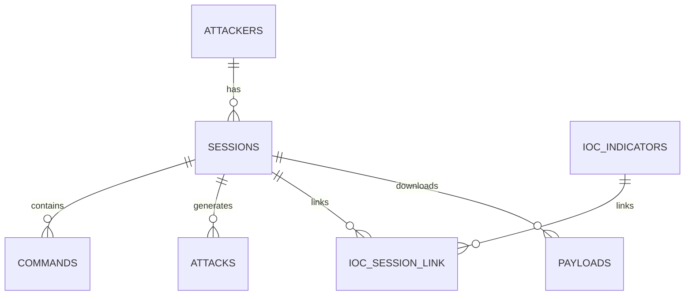

# Modèle de Données - Honeypot SOC

> Code-first documentation - alignée avec src/core/database.py

## Schéma relationnel (SQLAlchemy)



## Tables principales

### attackers
| Champ | Type | Description | Index |
|-------|------|-------------|-------|
| ip | String(45) | **PK** - IP attaquant | Oui |
| geoip | JSON | Données géolocalisation | Non |
| asn | String(50) | ASN réseau | Non |
| country | String(2) | ISO code pays | Non |
| threat_level | String(20) | low/medium/high/critical | Non |
| first_seen | DateTime | Première détection | Non |
| last_seen | DateTime | Dernière activité | Non |
| threat_score | Integer | Score 0-100 | Non |
| classification | String(30) | Enum classification | Non |
| reputation | String(100) | Réputation externe | Non |

### sessions
| Champ | Type | Description | Index |
|-------|------|-------------|-------|
| id | String(100) | **PK** - UUID session Cowrie | Oui |
| attacker_ip | String(45) | **FK** → attackers.ip | Oui |
| protocol | String(20) | SSH/Telnet | Non |
| start_time | DateTime | Début session | Non |
| end_time | DateTime | Fin session | Non |
| interaction_count | Integer | Nb commandes | Non |
| duration_seconds | Integer | Durée calculée | Non |

### commands
| Champ | Type | Description | Index |
|-------|------|-------------|-------|
| id | Integer | **PK** Auto-increment | Oui |
| session_id | String(100) | **FK** → sessions.id | Oui (`idx_commands_session_ts`) |
| command | Text | Commande exécutée | Non |
| timestamp | DateTime | Quand exécuté | Oui (`idx_commands_session_ts`) |
| flagged | Boolean | Suspect ? | Oui (`idx_commands_flagged`) |
| attacker_ip | String(45) | **Denormalisé** pour queries rapides | Non |

### attacks
| Champ | Type | Description | Index |
|-------|------|-------------|-------|
| id | Integer | **PK** Auto-increment | Oui |
| session_id | String(100) | **FK** → sessions.id | Oui (`idx_attacks_session`) |
| attacker_ip | String(45) | IP (denormalisé) | Non |
| protocol | String(20) | SSH/Telnet | Non |
| timestamp | DateTime | Quand attaque | Oui (`idx_attacks_ts`) |
| attack_type | String(50) | SCAN/BRUTE_FORCE/etc | Non |
| payload | Text | Charge utile | Non |
| severity | Integer | 0-100 | Oui (`idx_attacks_severity`) |

### ioc_indicators
| Champ | Type | Description | Index |
|-------|------|-------------|-------|
| id | Integer | **PK** Auto-increment | Oui |
| ioc_type | String(20) | hash/ip/domain/url | Non |
| value | Text | Valeur IOC | Non |
| first_seen | DateTime | Première détection | Non |
| last_seen | DateTime | Dernière détection | Non |
| confidence | Decimal(3,2) | 0.0-1.0 | Non |
| source | String(100) | scan/threatintel | Non |
| hit_count | Integer | Nb occurrences | Non |

### ioc_session_link (N:M)
| Champ | Type | Description |
|-------|------|-------------|
| ioc_id | Integer | **FK/PK** |
| session_id | String(100) | **FK/PK** |
| created_at | DateTime | Lien créé |

### payloads
| Champ | Type | Description | Index |
|-------|------|-------------|-------|
| id | Integer | **PK** Auto-increment | Oui |
| sha256 | String(64) | Hash du fichier | Oui (`idx_payloads_sha256`) |
| md5 | String(32) | Hash secondaire | Non |
| size | Integer | Taille octets | Non |
| entropy | Decimal(4,2) | Entropie fichier | Non |
| file_type | String(100) | Type MIME | Non |
| strings | JSON | Strings extraites | Non |
| suspicious | JSON | Patterns suspects | Non |
| packed | Boolean | Packed ? | Non |
| source_session_id | String(100) | **FK** Session source | Non |

## Relations clés

```
attackers:1 → sessions:N (ondelete=CASCADE)
sessions:1 → commands:N (ondelete=CASCADE)
sessions:1 → attacks:N (ondelete=CASCADE)
ioc_indicators:N → ioc_session_link:N → sessions:N
```

## Contraintes d'intégrité

- **CASCADE DELETE** : Suppression attaquant → cascade sur sessions/commands/attacks
- **Denormalisation** : `attacker_ip` dans commands/attacks pour queries rapides
- **Timestamps** : `created_at` sur toutes les tables
- **Index composites** : Pour requêtes multi-colonnes (session_id + timestamp)

## Migrations

Les tables sont créées via SQLAlchemy `Base.metadata.create_all()` au démarrage (`init_db()` dans `src/core/database.py`).