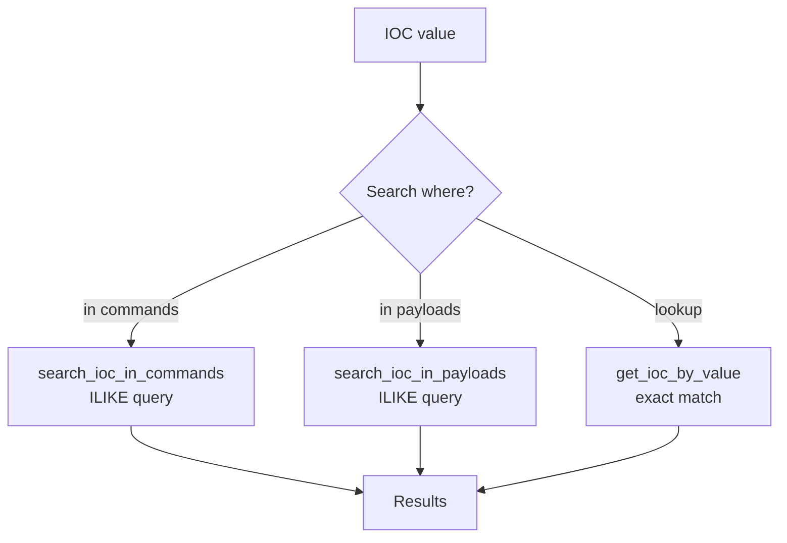

# Database & IOC Queries

> Code-first documentation - alignée avec src/infrastructure/database/queries.py

## Session Queries

### Top Attackers
```python
# get_top_attackers(limit=10)
SELECT attacker_ip, COUNT(*) as attack_count
FROM sessions
GROUP BY attacker_ip
ORDER BY attack_count DESC
LIMIT {limit};
```
**Usage** : Dashboard homepage, badge danger

### Flagged Commands
```sql
# get_flagged_commands()
SELECT c.command, s.attacker_ip, c.timestamp
FROM commands c
JOIN sessions s ON c.session_id = s.id
WHERE c.flagged = true
ORDER BY c.timestamp DESC;
```
**Index** : `idx_commands_flagged`

### Attack Timeline
```sql
# get_attack_timeline(hours=24)
SELECT DATE_TRUNC('hour', start_time) as hour,
       COUNT(*) as attacks,
       AVG(threat_score) as avg_score
FROM sessions s
JOIN attackers a ON s.attacker_ip = a.ip
WHERE start_time > NOW() - INTERVAL '{hours} hours'
GROUP BY hour
ORDER BY hour DESC;
```

---

## IOC Queries

### Create IOC
```sql
INSERT INTO ioc_indicators 
(ioc_type, value, confidence, source, related_attacker_ip, related_session_id)
VALUES ('{ioc_type}', '{value}', {confidence}, 
        '{source}', '{attacker_ip}', '{session_id}')
RETURNING id, value, hit_count;
```

### Deduplication
```sql
# get_ioc_by_value(value)
SELECT id, ioc_type, value, hit_count, confidence, source
FROM ioc_indicators 
WHERE value = '{value}';
```

### Hit Increment
```sql
UPDATE ioc_indicators 
SET hit_count = hit_count + 1, last_seen = NOW()
WHERE id = {ioc_id}
RETURNING hit_count;
```

### Top IOCs
```sql
SELECT ioc_type, value, hit_count, source, first_seen
FROM ioc_indicators
ORDER BY hit_count DESC
LIMIT {limit};
```

---

## IOC Search Flow



---

## Query Patterns

### Index Recommendations
| Table | Query | Index requis |
|-------|-------|--------------|
| commands | `WHERE flagged = true` | `idx_commands_flagged` ✅ |
| commands | `WHERE session_id = ?` | `idx_commands_session_ts` ✅ |
| attacks | `WHERE session_id = ?` | `idx_attacks_session` ✅ |
| ioc_indicators | `WHERE value = ?` | **Missing** ❌ |

### Performance Notes
- `ILIKE` queries : attention full table scan si pas d'index
- `JOIN` sessions+attackers : index sur attacker_ip ✅

---

## Repository Usage

```python
# Via SQLAlchemy dans les endpoints
from src.core.database import SessionDB
from sqlalchemy.orm import Session

# Raw query execution pattern
def get_top():
    result = db.execute(text(query))
    return [dict(row) for row in result]
```

**Tests associés** : `tests/test_queries.py`