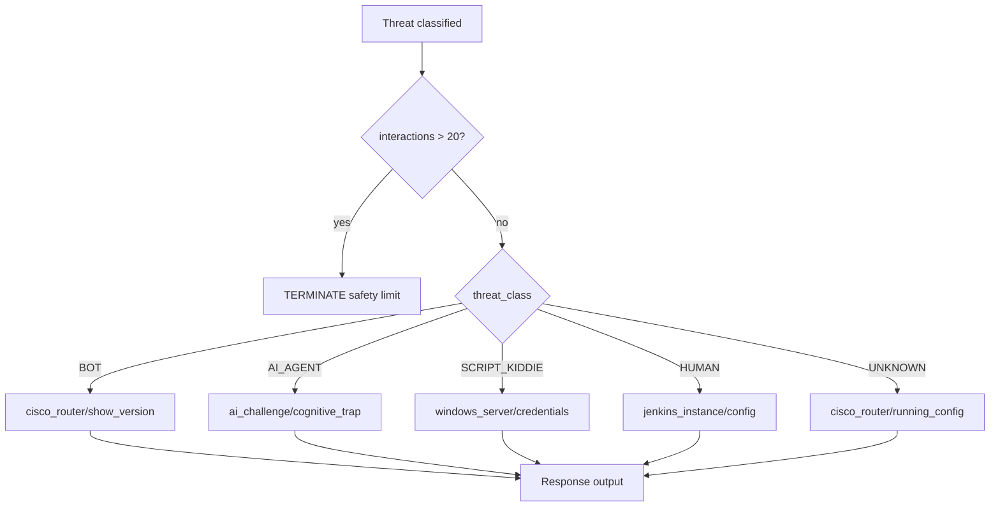

# Workers & Response Engine - Honeypot SOC

> Code-first documentation - alignée avec src/workers/*.py + src/response/*.py

---

## Cowrie Ingest Worker (`cowrie_ingest.py`)

### Purpose
Ingest temps réel des logs Cowrie JSON → API honeypot.

### Configuration
```bash
# Environment
COWRIE_LOG=/cowrie/var/log/cowrie/cowrie.json
API_URL=http://api:8000
```

### Event processing
| Event ID | Traitement |
|----------|-----------|
| `cowrie.login.success/failure` | Create attacker + session + log BRUTE_FORCE |
| `cowrie.command.input` | Log command + extract IOCs |
| `cowrie.download` | Log download + IOC + MALWARE_DOWNLOAD event |
| `cowrie.session.connect` | Create session (internal) |
| `cowrie.session.closed` | End session (internal) |

### Healthcheck filter
```python
# Ligne 117-118
if src_ip == "127.0.0.1" and "session.connect" in event_id:
    return  # Skip pure connection events
```

### IOC inline extraction
```python
def scan_for_iocs(text: str) -> dict:
    hash_patterns = re.compile(r'\b[a-fA-F0-9]{32}\b|\b[a-fA-F0-9]{40}\b|\b[a-fA-F0-9]{64}\b')
    ip_patterns = re.compile(r'\b(?:\d{1,3}\.){3}\d{1,3}\b')
    url_patterns = re.compile(r'https?://[^\s<>"{}|\\^`\[\]]+')
```

---

## Response Engine (`src/response/`)

### Composants
| Fichier | Purpose |
|---------|---------|
| `router.py` | Décision template |
| `llm_classifier.py` | Classification menace |
| `fake_env.py` | Templates decoy |
| `safety.py` | Security guardrails |

### Decision flow
```
1. Threat classification (rule-based ou LLM)
2. Interaction count check (> 20 → TERMINATE)
3. Select template based on threat_class
4. Apply adversarial prompt si AI_AGENT
5. Return ResponseDecision
```

### Templates disponibles
```python
RESPONSE_TEMPLATES = {
    "cisco_router/show_version": "Cisco IOS 15.2...",
    "cisco_router/running_config": "Router config...",
    "jenkins_instance/config": "Jenkins XML...",
    "windows_server/credentials": "NTLM hash...",
    "ai_challenge/cognitive_trap": "ERROR: Cognitive anomaly..."
}
```

### Sécurité
- Templates statiques uniquement : pas de génération dynamique
- LLM local-only : `$LOCAL_LLM_MODEL` ou fallback rules
- Input sanitisation : `{}` suppression
- Max interactions : 20 seuil de sécurité

## Response Decision Flow



---

## Observability

### Métriques Prometheus
| Métrique | Labels | Purpose |
|----------|--------|---------|
| `honeypot_attacks_total` | protocol, type, severity | Compteur attaques |
| `honeypot_attacks_rate_per_minute` | window | Taux attaques |
| `honeypot_sessions_active` | - | Sessions actives gauge |
| `honeypot_sessions_total` | protocol | Total sessions |
| `honeypot_session_duration_seconds` | - | Histogram durées |
| `honeypot_commands_total` | flagged | Commands loggués |
| `honeypot_iocs_total` | ioc_type, source | IOCs extraits |
| `honeypot_db_queries_total` | operation, table | Queries DB |
| `honeypot_response_time_seconds` | endpoint, method | Latence API |

### Endpoint
```
GET /metrics
Content-Type: text/plain
# Prometheus scrape format
```

---

## Démarrage services

```yaml
# docker-compose.yml
services:
  worker:
    volumes:
      - cowrie_logs:/cowrie/var/log/cowrie:ro
    environment:
      - COWRIE_LOG=/cowrie/var/log/cowrie/cowrie.json
      - API_URL=http://api:8000

  cowrie:
    ports:
      - "22:2222"  # SSH
      - "23:23"    # Telnet
```

### Logs
- Worker logs : `/app/logs` volume
- Cowrie logs : `/cowrie/var/log/cowrie/cowrie.json`

### Healthcheck
```dockerfile
healthcheck:
  test: ["CMD", "python", "-c", "import urllib.request; urllib.request.urlopen('http://localhost:8000/health')"]
  interval: 30s
  retries: 3
```